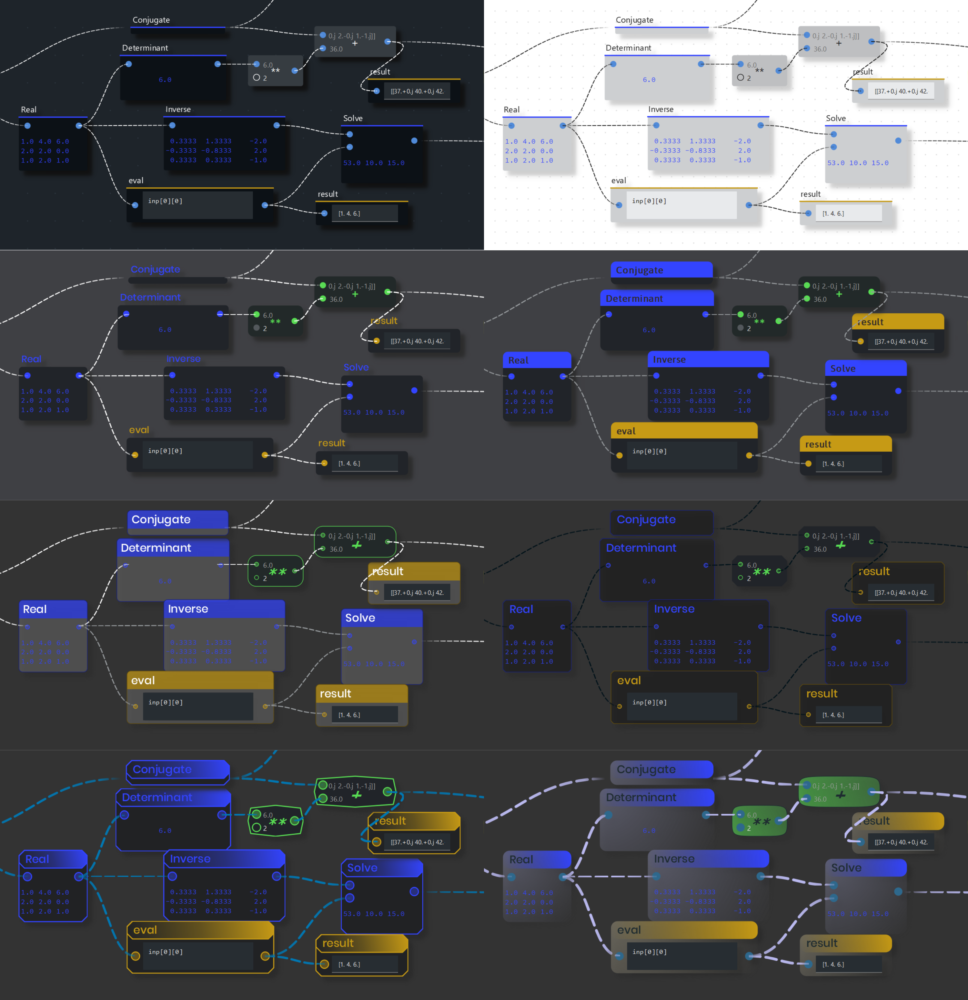
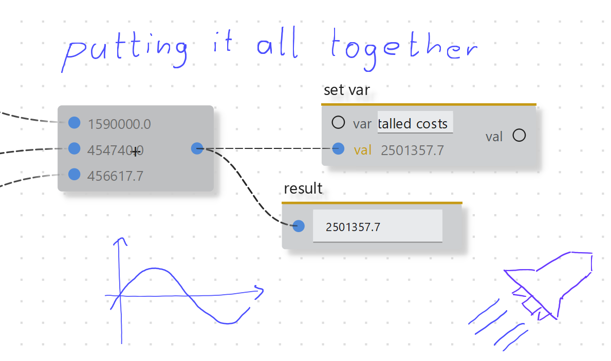

<p align="center">
  
</p>

# A simple flow-based visual scripting env for Python

## Introduction

Hello there! Ryven is an editor combining flow-based visual scripting with Python. It provides an easy to use system for programming nodes executing any Python code.

Ryven is now based on [ryvencore-qt](https://github.com/leon-thomm/ryvencore-qt), a guide for Ryven can be found [here](https://ryven.org/guides.html#/).

*Ryven 3 and the new underlying framework haven't been tested extensively yet, so there might be some further changes incoming.*

## Installation

```
git clone https://github.com/leon-thomm/ryven
cd Ryven
pip install -r requirements.txt
cd Ryven/src
python Ryven.py
```

## Features

#### simple nodes system
All information about a node is part of its class. A minimal node definition can be as simple as this

```python
class PrintNode(Node):
    """Prints your data."""

    title = 'Print'
    init_inputs = [
        NodeInputBP()
    ]
    color = '#A9D5EF'

    def update_event(self, inp=-1):
        print(self.input(0))
```

#### macros / subgraphs
You can define *macros* which get registered as nodes themselves


Macros are like all other scripts, so they have their own flow, plus input and output node


#### right click operations system for nodes
which can be edited through the API at any time.
```python
class MyNode(Node):
    ...

    def a_method(self):
        self.actions['do something'] = {
            'method': self.do_sth,
        }

    # with some method...
    def do_sth(self):
        ...
```

#### Qt widgets
You can add custom QWidgets for your nodes, so you can also easily integrate your existing Python-Qt widgets.
```python
class MyNode(Node):
    main_widget_class = MyNode_MainWidget
    main_widget_pos = 'below ports'  # alternatively 'between ports'
    # ...
```
<!-- - **convenience GUI classes** -->

#### many different modifiable themes


#### exec flow support
While data flows are the most common use case, exec flows (like [UnrealEngine BluePrints](https://docs.unrealengine.com/4.26/en-US/ProgrammingAndScripting/Blueprints/)) are also supported. 
<!-- While while it can lead to issues when using exec connections in data flows, conceptually this also works and has proven to be also really powerful if applied correctly. -->

#### stylus support for adding handwritten notes


#### rendering flow images

#### logging support
```python
import logging

class MyNode(Node):
    def __init__(self, params):
        super().__init__(params)

        self.logger = self.new_logger('nice log')
    
    def update_event(self, inp=-1):
        self.logger.log(logging.INFO, 'updated!')
```

#### variables system
with an update mechanism to build nodes that automatically adapt to change of variables.

```python
class MyNode(Node):
    ...

    def a_method(self):
        self.register_var_receiver('x', method=self.process)

    # with some method...
    def process(self, val_of_x):
        # processing new value of x
        ...
```

Also visit the [website](https://ryven.org) if you haven't been there already.

Ryven is now built on top of [ryvencore-qt](https://github.com/leon-thomm/ryvencore-qt), a framework for building Ryven-like editors. Nodes from Ryven are easily migratable to other ryvencore-qt editors.

## Contributions

To support the development of this project, which will decide its future, check out the [ryvencore-qt](https://github.com/leon-thomm/ryvencore-qt) repo where the main development is happening.

Feel free to open discussions here (there's a discussions area in this repo).

The docs page on the website is made with [Docsify](https://github.com/docsifyjs/docsify/), so you can improve it by simply editing the markdown.

Cheers.
# Bling
